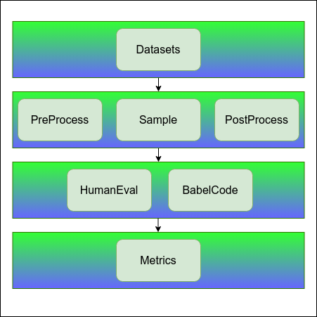

# llm-bench: Code evaluation benchmark for large language models

Based on the benchmarks of the HumanEval and BabelCode frameworks, llm-bench can evaluate the code generation capabilities of large
language models in multiple language dimensions such as Python, Java, Go, and C++ in Chinese and English based on the HumanEval data set.



## Dataset-HumanEval

We use the HumanEval dataset released by OpenAI as the original dataset, which has 164 programming problems, including numbers,
function headers, docstrings, body text, and multiple unit tests. Programming questions are written in Python and contain English
natural text in comments and docstrings. So we use this data set to examine the English Python code capabilities of the large language
model. In addition, we also translate the prompt field of the data set into Chinese to examine the Chinese Python code capabilities of
the model. In addition, using the BabelCode framework, we converted the HumanEval dataset into Java, Go, C++, etc. in Chinese and
English respectively to examine the code generation capabilities of the model in multiple languages.

- **Repository:** [GitHub Repository](https://github.com/openai/human-eval)

```python
from datasets import load_dataset
load_dataset("openai_humaneval")

DatasetDict({
    test: Dataset({
        features: ['task_id', 'prompt', 'canonical_solution', 'test', 'entry_point'],
        num_rows: 164
    })
})
```

An example of a dataset instance:

```json
{
    "task_id": "HumanEval/0",
    "prompt": "def has_close_elements():\n",
    "canonical_solution": "    return 1",
    "test": "def check(candidate):\n    assert candidate() == 1",
    "entry_point": "has_close_elements"
}
```

Data Fields:

- `task_id`: Identifier for the data sample
- `prompt`: Input for the model containing function header and docstrings
- `canonical_solution`: Solution for the problem in the `prompt`
- `test`: Contains function to test generated code for correctness
- `entry_point`: Entry point for test

The example below demonstrates the transformation into the data format supported by the BabelCode framework:

```json
{
    "id": "0",
    "title": "HumanEval/0",
    "testing_code": "assert has_close_elements() == True",
    "solution": "   return 1",
    "text": "Check   ",
    "entry_fn_name": "has_close_elements"
}
```

BabelCode Data Fields:：

- `id`: The unique id of the question
- `title`: The title of the question.
- `testing_code`: A string containing assert statements that will be parsed into the test cases.
- `solution`: The **Python** solution that will be used to get the signature and arguments.
- `text`: The Natural Language text description of the problem. Used for creating prompts.
- `entry_fn_name`: Entry point for test

## How to Use llm-bench

### Evaluation Environment

If you need to test other models or use a different runtime environment, please refer to the documentation or instructions of the model
you are using to obtain information about the required runtime environment and CUDA version. Afterward, modify the base image and
install the corresponding dependencies accordingly in the llm-bench/Dockerfile based on your requirements. In addition, the evaluation
of the generated codes involves compiling and running in multiple programming languages. The versions of the programming language
environments and packages we use are as follows:

| Dependency     | Version      |
| ------- |----------|
| Python  | 3.8.10   |
| JRE     | 2:1.11*  |
| Node.js | 16.13.0  |
| npm     | 8.1.0    |
| g++     | 9.4.0    |
| dart    | 2.18.5   |

In order to save everyone the trouble of setting up the environments for these languages, we create a Docker image with the required environments and llm-bench.

```bash
docker pull XXXXXXXXXXXXXX
```

If you are familiar with docker, you can build the image from `llm-bench/Dockerfile` or configure the Dockerfile as you like it:

```bash
cd llm-bench
docker build [OPTIONS] .
```

### Evaluation Datasets

Samples are stored in JSON list format in the `llm-bench/data` directory. Depending on the downstream task you require, you can choose from the following datasets:

- ``HumanEval.jsonl``: Used to evaluate Python code capabilities in English.
- ``HumanEval_CN.jsonl``: Used to evaluate Python code capabilities in Chinese.
- ``BabelCode_HumanEval.jsonl``: Used to evaluate Java Go C++ code capabilities in English.
- ``BabelCode_HumanEval_CN.jsonl``: Used to evaluate Java Go C++ code capabilities in Chinese.

### Datasets Processor

We have designed a base class named DataProcessorBase, allowing users to inherit the base class and create their own processor subclasses based on the specifics of their inference models.
The main purpose is to handle data preprocessing and postprocessing based on different model requirements. Three essential abstract functions need to be implemented:

- `add_template`: Add templates for a specified programming language. Calling this function with the programming language as a parameter will return a dictionary containing different templates for that language.
This is useful for generating templated text for questions.

- `process_input`: Process input data and generate a formatted question string. Provide a dictionary containing evaluation type, programming language, and dataset-related information as parameters.
Calling this function will return a formatted question string, which serves as input for evaluating model performance.

- `process_output`: Process output data and reformat if necessary. Provide a dictionary containing evaluation type, programming language, and model output information as parameters.
Calling this function will return a processed output information dictionary. This helps in aligning the output with specific standards or formats.

Taking the "codellama-34b-base" model as an example, we registered a data processor named "codellama-34b-base-hft."
This data processor is created by inheriting from `DataProcessorBase` and defining a subclass named `CodellamaDataProcessorHft`.
If there is a need to change the pre-processing and post-processing for a different model in the future, modifications can be made to the functions within the subclass as well as the registered name of the data processor.
During testing, the specific data processor can be used as needed.

### Run Commands

After obtaining the image, use the following command to create a container based on your task:

To test Python in English:

```bash
docker run -it \
 --gpus all \
 -v < PATH TO YOUR MODEL >:/model \
 -v < PATH TO YOUR OUTPUT >:/output \
 -e EKWARGS_0='{"dataset_filename":"HumanEval.jsonl",
                "eval_type":"HumanEval",
                "language":"Python",
                "dataprocessor_name":"codellama-34b-base-hft",
                "eval_times":1}'\
 -e GKWARGS_0='{"max_length_input":2048,"max_length_output":2048}' \
 -e INPUT_DIR="data/" \
 -e LLM_GPT_MODEL_DIR="/model" \
 -e CUDA_VISIBLE_DEVICES=0 \
 <IMAGE NAME:TAG> \
 python3 accuracy/src/main.py
```

To test Python in Chinese, you simply need to change the `dataset_filename` parameter in the above Docker commands to `HumanEval_CN.jsonl`.

For conducting multilingual testing using the BabelCode framework, let's take testing Java in English as an example:

```bash
docker run -it \
 --gpus all \
 -v < PATH TO YOUR MODEL >:/model \
 -v < PATH TO YOUR OUTPUT >:/output \
 -e EKWARGS_0='{"dataset_filename":"BabelCode_HumanEval.jsonl",
                "eval_type":"BabelCode",
                "language":"Java",
                "dataprocessor_name":"codellama-34b-base-hft",
                "eval_times":1}'\
 -e GKWARGS_0='{"max_length_input":2048,"max_length_output":2048}' \
 -e INPUT_DIR="data/" \
 -e LLM_GPT_MODEL_DIR="/model" \
 -e CUDA_VISIBLE_DEVICES=0 \
 <IMAGE NAME:TAG> \
 python3 accuracy/src/main.py
```

To test Go and C++, you just need to change the `language` parameter in the above Docker commands to Go and C++, respectively.
For testing in Chinese, you only need to change the `dataset_filename` parameter in the above Docker commands to `BabelCode_HumanEval_CN.jsonl`.

### Parameter Description

- --gpus all, CUDA_VISIBLE_DEVICES=0: Specifies GPU resources. Modify according to your requirements.
- -v <PATH TO YOUR MODEL>:/model: Maps the model directory, and the model path is passed as an environment variable LLM_GPT_MODEL_DIR="/model".
- -v <PATH TO YOUR OUTPUT>:/output: Maps the output directory where evaluation process logs and results will be written.
- -e INPUT_DIR="data/": Sets the dataset input path through the environment variable INPUT_DIR. The default is the dataset under llm-bench/data, - and you can add datasets or map to other dataset paths as needed.
- Evaluation parameters EKWARGS_0: Optional parameters are as follows:

| Program Paramter   | Description  | Value |
|  ----  | ----  | ---- |
| dataset_filename |The name of the dataset | default='HumanEval.jsonl' |
| eval_type | Framework used for evaluation | support: 1.HumanEval 2.Babelcode|
| language | The language used for code evaluation | support: 1.Python 2.Java 3.Go 4.C++ |
| dataprocessor_name |The names of specific data processors registered for different models | default='codellama-34b-base-hft' |
| eval_times | The number of times to evaluate per this dataset | default=1 |

- Inference parameters GKWARGS_0: Optional parameters are as follows:

| Infer Paramter | Description | Value |
| ---- | ---- | ---- |
| max_length_input | Max length input | default=1024 |
| max_length_output | The largest number of tokens you hope for results |default=1024 |
| num_beams | Beam num |  default=1 |
| num_return_sequences | Return sequence num |  default=1 |
| return_tensors | Return as tensors |default='pt' |
| truncation | Truncate or not | default=0 |
| no_repeat_ngram_size | The length of ngram that cannot be repeated | default=0 |
| repetition_penalty | Repetition penalty applied to logits for both beam search and sampling. |  default=1.0 |
| temperature | Temperature applied to logits for both beam search and sampling |  default=0 |
| do_sample | Do sample | default=0 |
| remove_invalid_values | Remove invalid values | default=1 |
| skip_special_tokens | Skip special tokens or not | default=1 |

### Evaluation Results

Using the "codellama-34b-base" model as an example, the results for 8 different test scenarios are as follows:

| codellama-34b-base      | Accuracy|
|-------------------------|:-------:|
| HumanEval-Python-EN     | 51.22%  |
| HumanEval-Java-EN       | 45.96%  |
| HumanEval-Go-EN         | 27.95%  |
| HumanEval-C++-EN        | 44.72%  |
| HumanEval-Python-CN     | 43.29%  |
| HumanEval-Java-CN       | 42.86%  |
| HumanEval-Go-CN         | 22.36%  |
| HumanEval-C++-CN        | 42.86%  |

## BabelCode

```bash
@article{orlanski2023measuring,
  title={Measuring The Impact Of Programming Language Distribution},
  author={Orlanski, Gabriel and Xiao, Kefan and Garcia, Xavier and Hui, Jeffrey and Howland, Joshua and Malmaud, Jonathan and Austin, Jacob and Singh, Rishah and Catasta, Michele},
  journal={arXiv preprint arXiv:2302.01973},
  year={2023}
}
```

## HumanEval

```bash
@article{chen2021codex,
  title={Evaluating Large Language Models Trained on Code},
  author={Mark Chen and Jerry Tworek and Heewoo Jun and Qiming Yuan and Henrique Ponde de Oliveira Pinto and Jared Kaplan and Harri Edwards and Yuri Burda and Nicholas Joseph and Greg Brockman and Alex Ray and Raul Puri and Gretchen Krueger and Michael Petrov and Heidy Khlaaf and Girish Sastry and Pamela Mishkin and Brooke Chan and Scott Gray and Nick Ryder and Mikhail Pavlov and Alethea Power and Lukasz Kaiser and Mohammad Bavarian and Clemens Winter and Philippe Tillet and Felipe Petroski Such and Dave Cummings and Matthias Plappert and Fotios Chantzis and Elizabeth Barnes and Ariel Herbert-Voss and William Hebgen Guss and Alex Nichol and Alex Paino and Nikolas Tezak and Jie Tang and Igor Babuschkin and Suchir Balaji and Shantanu Jain and William Saunders and Christopher Hesse and Andrew N. Carr and Jan Leike and Josh Achiam and Vedant Misra and Evan Morikawa and Alec Radford and Matthew Knight and Miles Brundage and Mira Murati and Katie Mayer and Peter Welinder and Bob McGrew and Dario Amodei and Sam McCandlish and Ilya Sutskever and Wojciech Zaremba},
  year={2021},
  eprint={2107.03374},
  archivePrefix={arXiv},
  primaryClass={cs.LG}
}
```
